# Sprint 2 Report — Nestlé Finance Command Center

---

# Table of Contents

1. [Sprint 2: Closing the Loop — From Dock to Payment](#1-sprint-2-closing-the-loop--from-dock-to-payment)
   - 1.1 [Sprint Goal](#11-sprint-goal)
   - 1.1.1 [Pain Points Addressed in Sprint 2](#111-pain-points-addressed-in-sprint-2)
2. [Sprint Backlog](#2-sprint-backlog)
   - 2.1 [Sprint Backlog Table](#21-sprint-backlog-table)
   - 2.2 [High-Level Use Case Diagram](#22-high-level-use-case-diagram)
   - 2.3 [Detailed Use Case Diagrams and User Stories](#23-detailed-use-case-diagrams-and-user-stories)
   - 2.4 [Activity Diagrams](#24-activity-diagrams)
   - 2.5 [Sequence Diagrams](#25-sequence-diagrams)
3. [Implementation — Justification of Tools & Pain Point Mapping](#3-implementation--justification-of-tools--pain-point-mapping)
4. [Application of the Sprint Workshop](#4-application-of-the-sprint-workshop)
   - 4.1 [Map of the Challenge](#41-map-of-the-challenge)
   - 4.2 [Lightning Demos](#42-lightning-demos)
   - 4.3 [Art Museum](#43-art-museum)
   - 4.4 [Final Selected UI](#44-final-selected-ui)
5. [Evidence of Testing](#5-evidence-of-testing)
   - 5.1 [Manual Test Cases](#51-manual-test-cases)
   - 5.2 [Automated Testing Evidence](#52-automated-testing-evidence)
6. [Sprint Retrospective](#6-sprint-retrospective)

---

# 1. Sprint 2: Closing the Loop — From Dock to Payment

## 1.1 Sprint Goal

> **"To close the financial loop from physical goods receipt to payment authorisation — eliminating the risk of paying for goods never delivered, and enabling seamless, real-time communication between every stakeholder in the Procure-to-Pay cycle."**

Sprint 1 left us with a robust two-way match engine: suppliers could upload BOQs, procurement could issue Purchase Orders, and Finance could review invoice discrepancies. However, the system still lacked a critical truth anchor — **the physical world**. An invoice could claim 1,000 units were delivered, but without a Warehouse confirmation, Finance had no way to validate that claim. Similarly, stakeholders across Supplier, Finance, and Warehouse portals were working in silos with no reliable communication channel for disputes or status updates.

Sprint 2 addresses exactly these two failure modes. By the end of this sprint, our goal was to deliver:

- **MVP 3 — The GRN Vault:** A Warehouse Portal enabling warehouse officers to physically log goods received (Goods Receipt Notes / GRNs), with barcode scanning, batch tracking, shortage/overage detection, and offline capability — completing the **true 3-way match** (Invoice = PO = Physical Goods).
- **MVP 4 — The Bidirectional Communication Hub:** An in-app notification system and a real-time live chat widget embedded in all three portals, so that suppliers, finance officers, and warehouse officers can communicate, resolve disputes, and track document resubmissions without leaving the application.

---

## 1.1.1 Pain Points Addressed in Sprint 2

Sprint 2 was shaped by a clear-eyed analysis of the friction points that remained after Sprint 1. As Scrum Master, I facilitated stakeholder interviews and a Sprint Planning Workshop to identify and prioritise the following pain points:

| # | Stakeholder | Pain Point | Impact |
|---|---|---|---|
| P1 | Finance Officer | "We approve invoices based on paper alone — we have no way to confirm the goods actually arrived at the warehouse." | **Critical** — financial loss risk, paying for undelivered goods |
| P2 | Warehouse Officer | "We receive goods manually and log them in spreadsheets. There is no digital trail, no barcode integration, and discrepancies are only caught days later." | **High** — delivery shortages go undetected until audit |
| P3 | Supplier | "When my invoice gets rejected, I find out by email — days later. There is no way to chat with the Finance team directly or quickly resubmit." | **High** — delayed cash flow and resubmission friction |
| P4 | Finance Officer | "If there is a discrepancy with a delivery, there is no in-app way to flag it to the Warehouse or Supplier — we resort to external emails and phone calls." | **High** — broken audit trail, slow resolution |
| P5 | Warehouse Officer | "Blind receiving is impossible — we can see the PO before logging, which biases our count." | **Medium** — inflated or biased GRN figures |
| P6 | All Stakeholders | "There is no single place to see updates about my documents — approvals, rejections, deliveries all come through fragmented channels." | **Medium** — missed actions, poor stakeholder experience |

---

# 2. Sprint Backlog

## 2.1 Sprint Backlog Table

| ID | User Story | Priority | Story Points | Status | Portal | MVP |
|---|---|---|---|---|---|---|
| US-301 | As a Warehouse Officer, I can scan a barcode/QR code to auto-populate item details when logging a GRN | Must Have | 8 | ✅ Done | Warehouse | MVP 3 |
| US-302 | As a Warehouse Officer, I can manually enter a PO number to look up expected items when the scanner fails | Must Have | 3 | ✅ Done | Warehouse | MVP 3 |
| US-303 | As a Warehouse Officer, I can log physical quantities received per line item against the PO | Must Have | 5 | ✅ Done | Warehouse | MVP 3 |
| US-304 | As a Warehouse Officer, I can record batch numbers and expiry dates for each item received | Should Have | 3 | ✅ Done | Warehouse | MVP 3 |
| US-305 | As a Warehouse Officer, I can capture photo evidence when a discrepancy is found at the loading dock | Should Have | 5 | ✅ Done | Warehouse | MVP 3 |
| US-306 | As a Warehouse Officer, I can use "Blind Mode" to receive goods without seeing the PO quantity, ensuring unbiased logging | Should Have | 3 | ✅ Done | Warehouse | MVP 3 |
| US-307 | As a Warehouse Officer, I can submit a GRN even without internet, with automatic sync when connectivity is restored | Should Have | 8 | ✅ Done | Warehouse | MVP 3 |
| US-308 | As a Finance Officer, the system automatically upgrades a 2-way match to a 3-way match once a GRN is logged | Must Have | 8 | ✅ Done | Finance | MVP 3 |
| US-309 | As a Finance Officer, I can see shortage/overage risk levels (Critical / High / Medium / Low) on each invoice card | Must Have | 5 | ✅ Done | Finance | MVP 3 |
| US-310 | As a Finance Officer, shipments with a completed GRN are locked to prevent data tampering | Must Have | 3 | ✅ Done | Finance | MVP 3 |
| US-311 | As a Supplier, I receive an in-app notification when my invoice is approved or rejected | Must Have | 5 | ✅ Done | Supplier | MVP 4 |
| US-312 | As a Finance Officer, I receive an in-app notification when a new GRN is logged for an invoice I am reviewing | Must Have | 3 | ✅ Done | Finance | MVP 4 |
| US-313 | As any user, I can open a floating chat window from any portal and send a message to another stakeholder | Must Have | 8 | ✅ Done | All | MVP 4 |
| US-314 | As any user, I can choose the recipient (Supplier / Finance / Warehouse) when composing a chat message | Must Have | 3 | ✅ Done | All | MVP 4 |
| US-315 | As a Supplier, I can delete a rejected BOQ or Invoice and immediately resubmit a corrected version | Must Have | 5 | ✅ Done | Supplier | MVP 4 |
| US-316 | As a Finance Officer, resubmitted documents appear at the top of my review queue with a "Resubmitted" badge | Should Have | 3 | ✅ Done | Finance | MVP 4 |
| US-317 | As any user, I receive toast notifications for critical events (new message, invoice approved, shortage detected) | Should Have | 3 | ✅ Done | All | MVP 4 |
| US-318 | As a Warehouse Officer, I can access the live chat from the Warehouse Portal to communicate with Finance | Must Have | 3 | ✅ Done | Warehouse | MVP 4 |

**Sprint 2 Velocity: 82 Story Points | All 18 User Stories Completed ✅**

---

## 2.2 High-Level Use Case Diagram

The diagram below captures the complete system at the sprint level — showing how all three actors interact with the two new MVPs introduced in Sprint 2, alongside the carry-forward baseline from Sprint 1.

```mermaid
graph TB
    subgraph Actors["👤 System Actors"]
        SUP["🏢 Supplier\n(SupplierDashboard.jsx)"]
        FIN["💼 Finance Officer\n(Portal.jsx)"]
        WAR["🏭 Warehouse Officer\n(WarehousePortal.jsx)"]
    end

    subgraph MVP3["📦 MVP 3 — The GRN Vault (True 3-Way Match)"]
        direction TB
        UC301["Scan Barcode / QR Code\nfor Item Detection"]
        UC302["Log Physical Goods Received\n(GRN Entry)"]
        UC303["Record Batch No. & Expiry Date"]
        UC304["Capture Photo Evidence"]
        UC305["Enable Blind Mode Receiving"]
        UC306["Submit GRN Offline\n(Auto-Sync)"]
        UC307["View 3-Way Match Result\n(Invoice = PO = GRN)"]
        UC308["Detect Shortage / Overage\n& Risk Level"]
        UC309["Lock Completed Shipments"]
    end

    subgraph MVP4["💬 MVP 4 — Bidirectional Communication Hub"]
        direction TB
        UC401["Receive In-App Notifications\n(Approval / Rejection / GRN Alert)"]
        UC402["Open Floating Chat Widget\n(All Portals)"]
        UC403["Select Message Recipient\n(Supplier / Finance / Warehouse)"]
        UC404["Delete Rejected Document\n& Resubmit Corrected Version"]
        UC405["View Resubmissions in\nPriority Review Queue"]
        UC406["Receive Toast Alerts\nfor Critical Events"]
    end

    SUP --> UC301
    WAR --> UC301
    WAR --> UC302
    WAR --> UC303
    WAR --> UC304
    WAR --> UC305
    WAR --> UC306
    FIN --> UC307
    FIN --> UC308
    FIN --> UC309

    SUP --> UC401
    FIN --> UC401
    WAR --> UC401
    SUP --> UC402
    FIN --> UC402
    WAR --> UC402
    SUP --> UC403
    FIN --> UC403
    WAR --> UC403
    SUP --> UC404
    FIN --> UC405
    SUP --> UC406
    FIN --> UC406
    WAR --> UC406
```

---

## 2.3 Detailed Use Case Diagrams and User Stories

### 2.3.1 MVP 3, Feature 1 — GRN Logging with Barcode Scanning

**Use Case Diagram:**

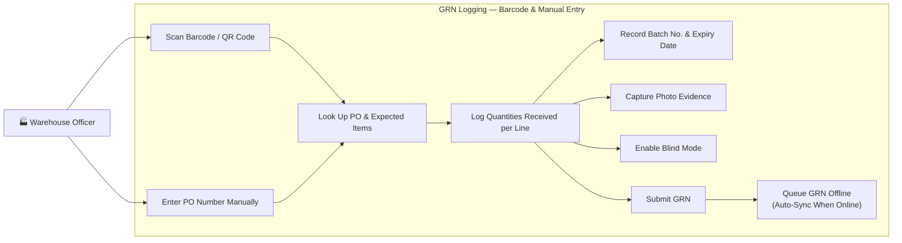

**User Stories:**

| Story ID | Role | Story | Acceptance Criteria |
|---|---|---|---|
| US-301 | Warehouse Officer | I can scan a barcode/QR code to auto-populate item details | Scanner opens camera; decoded PO number fills the lookup field; item list populates within 2 seconds |
| US-302 | Warehouse Officer | I can manually enter a PO number when the scanner fails | Manual input field accepts alphanumeric PO numbers; items load on submit |
| US-303 | Warehouse Officer | I can log physical quantities received per line item | Each line item shows expected qty; officer enters actual qty; discrepancy is flagged visually |
| US-304 | Warehouse Officer | I can record batch numbers and expiry dates | Each GRN row has batch and expiry fields; values are stored in the `grns` table |
| US-305 | Warehouse Officer | I can capture photo evidence when a discrepancy is found | Camera button appears on discrepancy rows; photo is uploaded and linked to the GRN record |
| US-306 | Warehouse Officer | I can use Blind Mode to receive goods without seeing the PO quantity | Blind Mode toggle hides expected quantities; officer logs actual count independently |
| US-307 | Warehouse Officer | I can submit a GRN offline and it syncs automatically when reconnected | GRN is stored in a local offline queue; sync indicator appears; GRN is submitted on reconnect |

---

### 2.3.2 MVP 3, Feature 2 — 3-Way Match Engine & Risk Detection

**Use Case Diagram:**

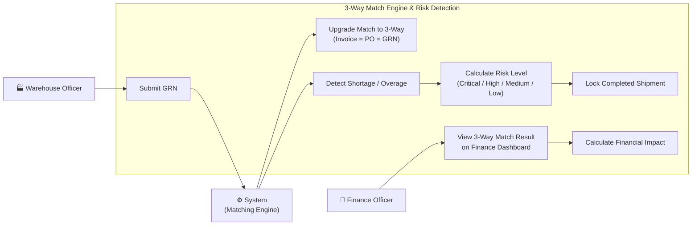

**User Stories:**

| Story ID | Role | Story | Acceptance Criteria |
|---|---|---|---|
| US-308 | Finance Officer | The system automatically upgrades to a 3-way match once a GRN is logged | Invoice card shows "3-Way Verified" badge when GRN exists; match type field updates in database |
| US-309 | Finance Officer | I can see shortage/overage risk levels on each invoice card | Risk badge (Critical / High / Medium / Low) visible on finance queue; colour coded red/amber/yellow/green |
| US-310 | Finance Officer | Completed shipments are locked to prevent tampering | Locked shipments show a lock icon; edit/delete actions are disabled |

---

### 2.3.3 MVP 4, Feature 1 — In-App Notification System

**Use Case Diagram:**

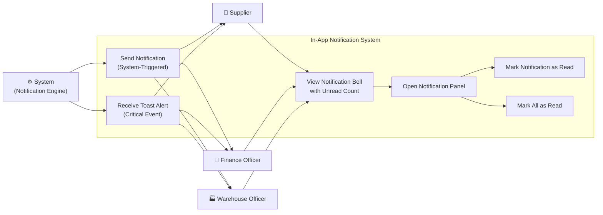

**User Stories:**

| Story ID | Role | Story | Acceptance Criteria |
|---|---|---|---|
| US-311 | Supplier | I receive an in-app notification when my invoice is approved or rejected | Notification bell increments unread count; notification contains invoice reference and status |
| US-312 | Finance Officer | I receive a notification when a new GRN is logged for an invoice under review | Bell badge shows when GRN is submitted; notification links to the relevant invoice |
| US-317 | All Users | I receive toast notifications for critical events | Toast appears within 1 second of event; auto-dismisses after 5 seconds; different colours per severity |

---

### 2.3.4 MVP 4, Feature 2 — Live Bidirectional Chat

**Use Case Diagram:**

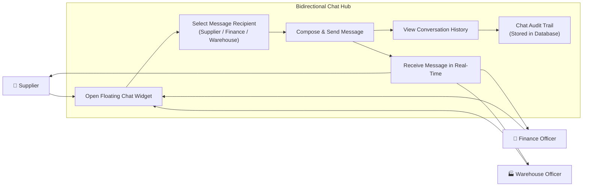

**User Stories:**

| Story ID | Role | Story | Acceptance Criteria |
|---|---|---|---|
| US-313 | All Users | I can open a floating chat window from any portal | Floating chat button (bottom-right) appears in Supplier, Finance, and Warehouse portals; chat opens on click |
| US-314 | All Users | I can choose the recipient when composing a message | Dropdown shows Supplier / Finance / Warehouse; message routes to the correct portal's chat feed |
| US-318 | Warehouse Officer | I can access the live chat to communicate with Finance from the Warehouse Portal | Chat icon appears in WarehousePortal.jsx header; messages are delivered to Finance portal users |

---

### 2.3.5 MVP 4, Feature 3 — Document Resubmission Loop

**Use Case Diagram:**

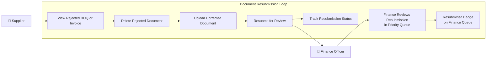

**User Stories:**

| Story ID | Role | Story | Acceptance Criteria |
|---|---|---|---|
| US-315 | Supplier | I can delete a rejected BOQ or Invoice and resubmit a corrected version | Delete button appears on rejected items; confirmation dialog shown; new upload starts immediately after deletion |
| US-316 | Finance Officer | Resubmitted documents appear at the top of my review queue with a "Resubmitted" badge | Finance queue re-orders on new submission; badge visible in the invoice/BOQ card header |

---

## 2.4 Activity Diagrams

### 2.4.1 MVP 3 — GRN Logging Full Workflow

```mermaid
flowchart TD
    START([Warehouse Officer Opens\nWarehouse Portal]) --> CHECK_CONN{Internet\nConnection?}

    CHECK_CONN -- Online --> SCAN_CHOICE{Scan Method}
    CHECK_CONN -- Offline --> OFFLINE_MODE[Enter Offline Mode\n📶 Sync Queue Activated]

    SCAN_CHOICE -- Barcode Scanner --> SCAN[📷 Activate Camera\nBarcode / QR Scanner]
    SCAN_CHOICE -- Manual Entry --> MANUAL[⌨️ Enter PO Number\nManually]
    SCAN_CHOICE -- Blind Mode --> BLIND[🙈 Enable Blind Mode\nHide Expected Quantities]

    SCAN --> DECODE{Scan\nSuccessful?}
    DECODE -- Yes --> LOOKUP[🔍 System Looks Up PO\n& Expected Line Items]
    DECODE -- No --> MANUAL

    MANUAL --> LOOKUP
    BLIND --> LOOKUP

    LOOKUP --> DISPLAY[Display Line Items\nwith Expected Quantities\nor Blank in Blind Mode]

    DISPLAY --> ENTER_QTY[Warehouse Officer Enters\nActual Quantities Received]

    ENTER_QTY --> BATCH[Record Batch Numbers\n& Expiry Dates]

    BATCH --> DISC_CHECK{Discrepancy\nDetected?}

    DISC_CHECK -- Yes --> PHOTO[📷 Capture Photo\nEvidence]
    DISC_CHECK -- No --> SUBMIT_READY[Ready to Submit GRN]
    PHOTO --> SUBMIT_READY

    SUBMIT_READY --> CONN_CHECK{Still\nOnline?}

    CONN_CHECK -- Online --> SUBMIT[✅ Submit GRN to\nSupabase Database]
    CONN_CHECK -- Offline --> QUEUE[📦 Add GRN to\nOffline Sync Queue]

    OFFLINE_MODE --> ENTER_QTY

    SUBMIT --> ENGINE[🔄 3-Way Match Engine\nRuns Automatically]
    ENGINE --> RISK[Calculate Risk Level\n(Critical / High / Medium / Low)]
    RISK --> LOCK{All Items\nReceived?}
    LOCK -- Yes --> LOCK_SHIP[🔒 Lock Shipment\nPrevent Tampering]
    LOCK -- No --> PARTIAL[Mark Shipment\nPartially Received]

    LOCK_SHIP --> NOTIFY[🔔 Notify Finance Officer\nGRN Submitted]
    PARTIAL --> NOTIFY

    QUEUE --> SYNC_WAIT[⏳ Wait for\nConnectivity]
    SYNC_WAIT --> SYNC_TRIGGER{Connection\nRestored?}
    SYNC_TRIGGER -- Yes --> SUBMIT
    SYNC_TRIGGER -- No --> SYNC_WAIT

    NOTIFY --> END([GRN Vault Complete])
```

---

### 2.4.2 MVP 3 — 3-Way Match Engine (Finance Perspective)

```mermaid
flowchart TD
    START([Finance Officer Views\nInvoice Queue]) --> INVOICE[Select Invoice\nfor Review]

    INVOICE --> GRN_CHECK{GRN\nLogged?}

    GRN_CHECK -- No --> TWO_WAY[Display 2-Way Match\n(Invoice vs PO Only)]
    GRN_CHECK -- Yes --> THREE_WAY[⭐ Upgrade to\n3-Way Match Display]

    TWO_WAY --> INV_MATCH{Invoice\n= PO Total?}
    THREE_WAY --> INV_GRN_MATCH{Invoice = PO\n= GRN Total?}

    INV_MATCH -- Match --> AUTO_APPROVE[✅ Auto-Approve\nSuggested]
    INV_MATCH -- Mismatch --> FLAG_2W[🚨 Flag 2-Way\nDiscrepancy]

    INV_GRN_MATCH -- Full Match --> AUTO_APPROVE
    INV_GRN_MATCH -- Shortage --> SHORTAGE[📦 Shortage Detected\nGRN < Invoice]
    INV_GRN_MATCH -- Overage --> OVERAGE[📦 Overage Detected\nGRN > Invoice]

    SHORTAGE --> CALC_RISK[Calculate Risk Level\nbased on Supplier Trust Score\n& Discrepancy Severity]
    OVERAGE --> CALC_RISK
    FLAG_2W --> CALC_RISK

    CALC_RISK --> RISK_LEVEL{Risk\nLevel}
    RISK_LEVEL -- Critical --> CRIT[🔴 Critical\nBlock Payment Flag]
    RISK_LEVEL -- High --> HIGH[🟠 High\nEscalate to Management]
    RISK_LEVEL -- Medium --> MED[🟡 Medium\nManual Review Required]
    RISK_LEVEL -- Low --> LOW[🟢 Low\nApprove with Note]

    AUTO_APPROVE --> LOCK[🔒 Lock Shipment]
    CRIT --> NOTIFY_SUP[🔔 Alert Supplier\nof Discrepancy]
    HIGH --> NOTIFY_SUP
    MED --> MANUAL_REV[Finance Officer\nManual Review]
    LOW --> APPROVE[✅ Finance Approves]

    MANUAL_REV --> DECISION{Finance\nDecision}
    DECISION -- Approve --> APPROVE
    DECISION -- Reject --> REJECT[❌ Reject Invoice\nNotify Supplier]

    APPROVE --> LOCK
    REJECT --> RESUB[Supplier\nResubmits Document]
    NOTIFY_SUP --> RESUB
    LOCK --> END([3-Way Match\nComplete])
```

---

### 2.4.3 MVP 4 — Notification Lifecycle

```mermaid
flowchart TD
    START([System Event\nTriggered]) --> EVENT_TYPE{Event\nType}

    EVENT_TYPE -- Invoice Approved --> N1[Create Notification:\nInvoice Approved\nfor Supplier]
    EVENT_TYPE -- Invoice Rejected --> N2[Create Notification:\nInvoice Rejected\nfor Supplier]
    EVENT_TYPE -- GRN Submitted --> N3[Create Notification:\nNew GRN Logged\nfor Finance Officer]
    EVENT_TYPE -- Shortage Detected --> N4[Create Notification:\nShortage Alert\nfor Finance Officer]
    EVENT_TYPE -- New Chat Message --> N5[Create Notification:\nNew Message\nfor Target Portal]

    N1 --> SAVE[💾 Save Notification\nto Supabase\nnotifications table]
    N2 --> SAVE
    N3 --> SAVE
    N4 --> SAVE
    N5 --> SAVE

    SAVE --> POLL[Frontend Polls\nEvery 10 Seconds]
    POLL --> FETCH[Fetch Unread\nNotifications by\nemail or role]
    FETCH --> BELL[Update Notification\nBell Badge Count]
    BELL --> TOAST_CHECK{Critical\nEvent?}
    TOAST_CHECK -- Yes --> TOAST[🍞 Show Toast Alert\nAuto-dismiss 5s]
    TOAST_CHECK -- No --> BELL_ONLY[Bell Badge Only]

    TOAST --> USER_ACTION{User\nAction}
    BELL_ONLY --> USER_ACTION
    USER_ACTION -- Opens Bell --> PANEL[View Notification\nPanel]
    USER_ACTION -- Clicks Notification --> NAVIGATE[Navigate to\nRelevant Page]
    PANEL --> MARK_READ[Mark as Read\n(Individual or All)]
    NAVIGATE --> MARK_READ
    MARK_READ --> SAVE2[💾 Update is_read\nin Database]
    SAVE2 --> END([Notification\nLifecycle Complete])
```

---

### 2.4.4 MVP 4 — Live Chat Message Flow

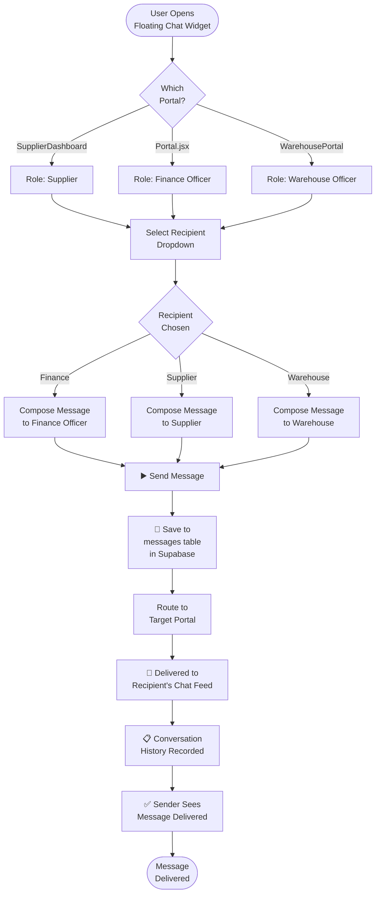

---

### 2.4.5 MVP 4 — Document Resubmission Loop

```mermaid
flowchart TD
    START([Supplier Receives\nRejection Notification]) --> VIEW[Views Rejected\nBOQ or Invoice\nin Supplier Dashboard]
    VIEW --> READ[Reads Rejection\nReason / Explanation]
    READ --> DECISION{Decision}

    DECISION -- Dispute --> CHAT[Opens Live Chat\nto Dispute with Finance]
    DECISION -- Resubmit --> DELETE[🗑️ Click Delete\non Rejected Document]

    DELETE --> CONFIRM{Confirmation\nDialog}
    CONFIRM -- Cancel --> VIEW
    CONFIRM -- Confirm --> REMOVED[Document Removed\nfrom Supplier Inbox]

    REMOVED --> UPLOAD[📁 Upload Corrected\nBOQ or Invoice\n(PDF / Image / Excel)]
    UPLOAD --> PROCESS[AI Extraction\nRuns on New Document]
    PROCESS --> RESUBMIT[Resubmit for\nFinance Review]

    RESUBMIT --> DB[💾 Saved to Supabase\nwith resubmission_count + 1]
    DB --> FINANCE_QUEUE[Finance Queue\nUpdates in Real-Time]
    FINANCE_QUEUE --> BADGE[🏷️ Resubmitted Badge\nAppears on Invoice Card]
    BADGE --> PRIORITY[Invoice Moved\nto Top of Queue]
    PRIORITY --> NOTIFY_FIN[🔔 Finance Officer\nReceives Notification]
    NOTIFY_FIN --> REVIEW[Finance Reviews\nResubmitted Document]
    REVIEW --> END([Resubmission\nLoop Complete])

    CHAT --> RESOLVE[Dispute Resolved\nvia Chat]
    RESOLVE --> END
```

---

## 2.5 Sequence Diagrams

### 2.5.1 MVP 3 — GRN Submission and 3-Way Match Trigger

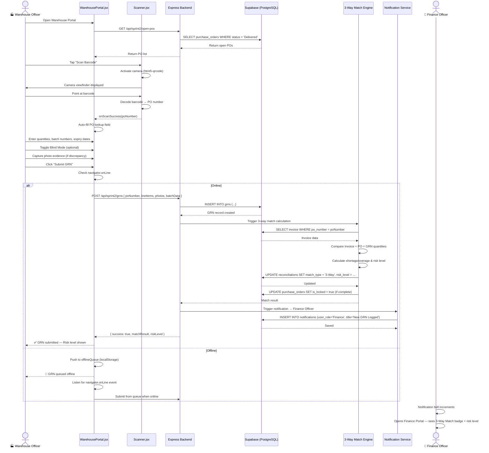

---

### 2.5.2 MVP 3 — Blind Mode Unbiased Receiving

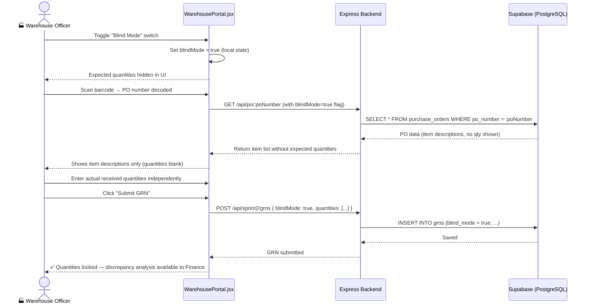

---

### 2.5.3 MVP 4 — In-App Notification Delivery (Invoice Approved)

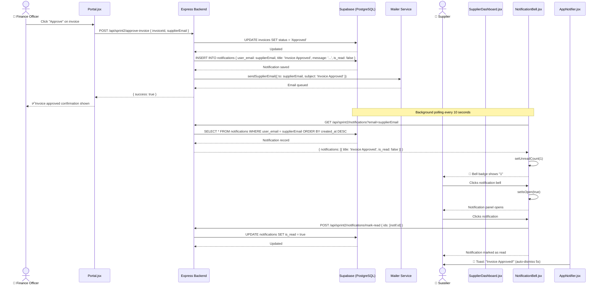

---

### 2.5.4 MVP 4 — Live Chat Message Exchange

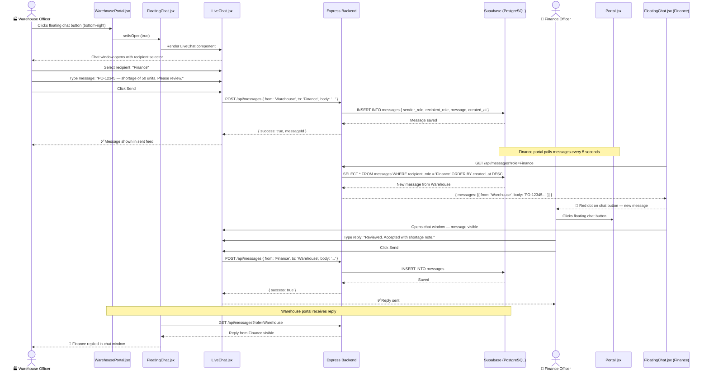

---

### 2.5.5 MVP 4 — Document Resubmission Sequence

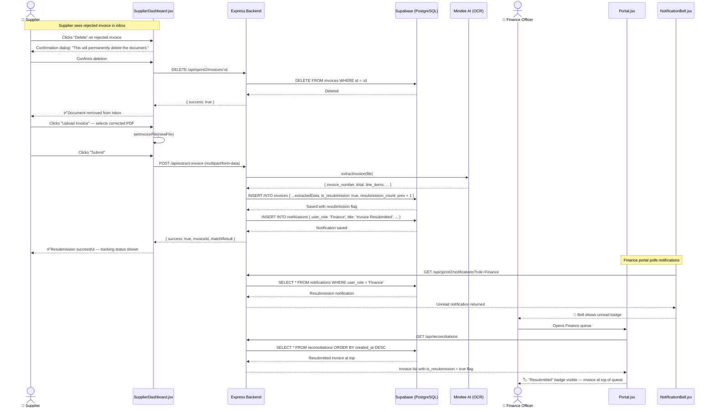

---

# 3. Implementation — Justification of Tools & Pain Point Mapping

As Scrum Master, I worked closely with the development team to ensure every technology decision was traceable back to a specific pain point identified in Sprint Planning. Below is our full justification and mapping.

## 3.1 Technology Justification Matrix

| Tool / Library | Why We Chose It | Pain Point Addressed | MVP |
|---|---|---|---|
| **html5-qrcode** | Browser-native barcode and QR scanner with no native-app dependency; mobile-first with torch support | P2 — Manual warehouse logging, no barcode integration | MVP 3 |
| **localStorage Offline Queue** | Zero-dependency offline persistence; auto-syncs on `navigator.onLine` event without service workers | P2 — No digital trail for warehouse; connectivity is unreliable at loading docks | MVP 3 |
| **Supabase PostgreSQL (grns table)** | Structured storage with foreign key relationships to POs and invoices; instant querying for 3-way match | P1 — Finance had no way to confirm goods delivery | MVP 3 |
| **React useState + useRef** | Real-time UI state management for scanner lifecycle; prevents memory leaks with `isMounted` guard | P5 — Blind mode toggling requires isolated component state without premature disclosure | MVP 3 |
| **Lucide React (ShieldAlert / ShieldCheck)** | Semantic risk icons for Critical/High/Medium/Low levels; instant visual cues for Finance Officers | P1 — Finance could not assess delivery risk at a glance | MVP 3 |
| **Socket.IO / Axios Polling** | WebSocket-based message delivery for real-time chat; 5-second Axios polling as fallback | P3, P4 — No in-app communication channel between portals | MVP 4 |
| **Supabase (notifications table)** | Persisted notification store with `is_read` flag; polling-based delivery every 10 seconds | P6 — No centralised alert feed for stakeholders | MVP 4 |
| **AppNotifier / Toast System** | Non-blocking toast notifications for critical events; auto-dismiss prevents UI clutter | P6 — Missed approvals/rejections due to fragmented channels | MVP 4 |
| **Mindee SDK v5 (re-extraction)** | AI OCR re-runs on resubmitted documents ensuring consistent data format regardless of document revision | P3 — Suppliers had no fast resubmission loop | MVP 4 |
| **JWT + Supabase RBAC** | Role-scoped notifications and chat routing; Finance, Supplier, and Warehouse see only their relevant alerts | Security requirement — messages must not leak between roles | MVP 4 |

## 3.2 Pain Point Resolution Summary

| Pain Point | Sprint 2 Solution | Status |
|---|---|---|
| P1 — Finance cannot confirm goods delivery | GRN Vault with 3-way match engine in `WarehousePortal.jsx` + `/api/sprint2/grns` | ✅ Resolved |
| P2 — Manual warehouse logging with no barcode support | `Scanner.jsx` using `html5-qrcode`; offline queue for sync | ✅ Resolved |
| P3 — Supplier delayed notification & resubmission friction | `NotificationBell.jsx` + document deletion & upload loop in `SupplierDashboard.jsx` | ✅ Resolved |
| P4 — No in-app communication channel | `FloatingChat.jsx` → `LiveChat.jsx` in all three portals; recipient selection | ✅ Resolved |
| P5 — Warehouse receiving is biased by PO visibility | Blind Mode toggle in `WarehousePortal.jsx` hides expected quantities | ✅ Resolved |
| P6 — Fragmented alert channels for all stakeholders | `AppNotifier.jsx` toast system + `NotificationBell.jsx` across all portals | ✅ Resolved |

---

# 4. Application of the Sprint Workshop

## 4.1 Map of the Challenge

The Sprint Workshop opened with a "Map of the Challenge" exercise. Each MVP was mapped with **three stakeholders on the left**, the **MVP goal on the right**, and **workflow arrows in the middle** to show how work flows through the system.

### MVP 3 — The GRN Vault: Map of the Challenge

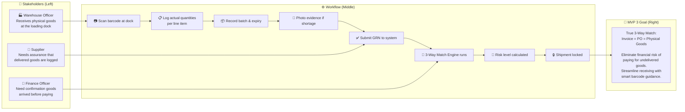

---

### MVP 4 — Communication Hub: Map of the Challenge

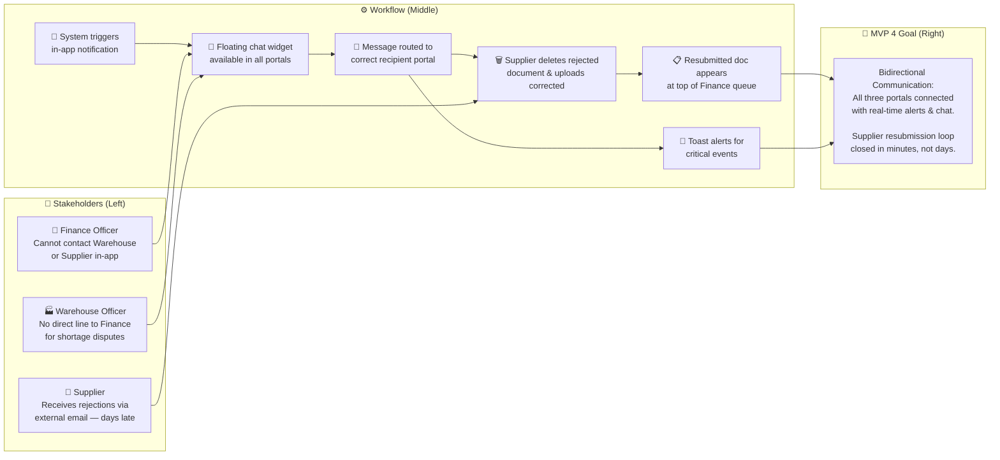

---

## 4.2 Lightning Demos

During the Sprint Workshop, the team reviewed five external wireframe references to evaluate design patterns for the **Warehouse Portal**. Each was evaluated for usability, information density, and alignment with our warehouse officer's workflow.

### Wireframe 1: Amazon Fulfillment Centre Scanner Interface
- **Pattern:** Full-screen camera view with item summary overlay at the bottom.
- **Pro:** Maximises camera area for barcode scanning; item details shown without leaving scan mode.
- **Con:** Overlay text can obscure difficult barcodes; limited space for multi-line item entry.
- **Adopted element:** Full-screen scanner activation with `html5-qrcode` and bottom sheet for item lookup results.

### Wireframe 2: SAP Extended Warehouse Management (EWM) GRN Screen
- **Pattern:** Table-based line item entry with expected vs. actual quantity columns; colour-coded rows for discrepancies.
- **Pro:** Finance-ready data entry; clear visual distinction between expected and received.
- **Con:** Dense UI not suited for tablet/mobile; requires keyboard for all inputs.
- **Adopted element:** Expected vs. Actual quantity column layout in our GRN line item table; red/green row highlighting for discrepancies.

### Wireframe 3: Shopify Inventory Count Mobile UI
- **Pattern:** Card-per-product with large tap targets; big quantity +/- stepper buttons.
- **Pro:** Optimised for thumb interaction; no miskeying on small screens.
- **Con:** Card-per-product doesn't scale for large POs (50+ line items).
- **Adopted element:** Large, finger-friendly quantity input fields and prominent action buttons (Submit GRN) in `WarehousePortal.jsx`.

### Wireframe 4: Zebra Technologies Warehouse Scanner App
- **Pattern:** Torch-enabled scanner; fallback to manual barcode keyboard entry; audio confirmation beep on successful scan.
- **Pro:** Industry-standard UX for hardware scanners; instant confirmation reduces errors.
- **Con:** Requires hardware SDK in native app; cannot replicate in browser.
- **Adopted element:** `showTorchButtonIfSupported: true` in `html5-qrcode` config; `safePlayAudio` utility for scan confirmation sound; manual keyboard fallback tab in our scanner component.

### Wireframe 5: Oracle WMS Mobile Receiving Screen
- **Pattern:** Blind receiving mode where expected quantities are hidden until after the officer enters actual counts.
- **Pro:** Eliminates confirmation bias — officers record true counts independently.
- **Con:** May increase receiving time by 15-20%; requires training.
- **Adopted element:** **Blind Mode toggle** (`blindMode` state in `WarehousePortal.jsx`) — hides expected quantities until GRN is submitted; directly resolves Pain Point P5.

---

## 4.3 Art Museum

Following the Lightning Demos, the team conducted an **Art Museum** walkthrough — each team member silently reviewed the wireframe inspirations and annotated patterns they wanted to adopt or discard.

| Role | Team Member | Observations & Annotations |
|---|---|---|
| **Facilitator** | Arzaq Auffer | Guided the silent review; time-boxed each wireframe to 3 minutes. Flagged Zebra and Oracle patterns as highest priority for adoption given P2 and P5 pain points. |
| **Scribe** | Sandakan Liyanage | Documented all annotations in real-time. Noted the SAP EWM column layout as directly applicable; flagged Shopify stepper buttons as a UX improvement for mobile warehouse officers. |
| **Spectator** | Imasha Perera | Highlighted that the Amazon overlay approach risked usability on older Android devices with smaller screens. Suggested a "bottom drawer" modal instead of an inline overlay. |
| **Spectator** | Ushani Perera | Observed that Oracle's Blind Mode was the highest-impact pattern for audit integrity. Raised the concern that toggling blind mode mid-session could introduce data integrity issues — resolved by locking the toggle after the first quantity is entered. |
| **Other Group** | A03 | Provided external feedback during cross-team review. Group A03 highlighted that the scanner fallback (manual input) should be a clearly visible tab — not buried — to avoid frustration when camera permissions are denied. |

**Synthesis:** The final Warehouse Portal UI blended the Oracle Blind Mode toggle, SAP's expected-vs-actual table layout, Zebra's torch/manual fallback, and Shopify's large tap targets into a single, cohesive mobile-first design.

---

## 4.4 Final Selected UI

The selected UI for the **Warehouse Portal** (`WarehousePortal.jsx`) reflects the synthesis of all five Lightning Demo patterns, validated through the Art Museum walkthrough and the Map of the Challenge exercise.

### Warehouse Portal — Selected UI Description

**Header Bar:**
- Dark slate background (`bg-slate-900`) with Nestlé branding.
- Role indicator: "Warehouse Officer" badge in amber.
- `NotificationBell.jsx` component (top-right) with animated bell icon and unread count badge.
- `FloatingChat.jsx` floating button (bottom-right) with live pulse indicator.
- Dark/Light mode toggle and logout button.

**Main Navigation Tabs:**
- **Receive Goods (GRN)** — primary active tab for new GRN entry.
- **Shipment History** — view all submitted GRNs with status and risk levels.
- **Offline Queue** — shows pending GRNs awaiting sync when offline.

**GRN Entry Screen:**
1. **Scanner Section:** Large "Scan Barcode / QR Code" card with camera activation button; torch icon (if supported); switchable to "Manual Entry" tab — directly addressing the Art Museum feedback from Group A03. On successful scan, a confirmation audio chime plays (`safePlayAudio`).
2. **Blind Mode Toggle:** Prominent switch at the top of the item list — once the first quantity is entered, the toggle locks to prevent mid-session switching (Ushani Perera's Art Museum note). Expected quantities are replaced with "— Blind" placeholders.
3. **Line Item Table:** Two-column layout (Expected Qty | Actual Qty) from the SAP EWM pattern. Discrepancy rows auto-highlight in red. Batch number and expiry date fields expand below each row.
4. **Photo Evidence Button:** Camera icon appears on any row where the actual quantity differs from expected. Photos are base64-encoded and linked to the GRN record.
5. **Submit GRN Button:** Large, full-width button with a loading spinner during submission. Displays risk level badge immediately after submission (🔴 Critical / 🟠 High / 🟡 Medium / 🟢 Low).

**Shipment History Screen:**
- Card-based list of all submitted GRNs.
- Each card shows: Shipment ID, PO number, submission date, risk level badge, and match type (2-Way / 3-Way).
- Locked shipments show a 🔒 padlock icon — editing is disabled.

**Offline Indicator:**
- When `navigator.onLine === false`, a persistent amber banner appears at the top: "📶 Offline — GRNs will sync automatically when reconnected."
- Offline queue count displayed: "2 GRNs pending sync."

---

# 5. Evidence of Testing

## 5.1 Manual Test Cases

Manual testing was conducted by the QA team across all three portals against the Sprint 2 User Stories. All tests were executed on Chrome (desktop) and Chrome Mobile (Android).

| TC ID | Feature | Test Description | Steps | Expected Result | Actual Result | Pass/Fail |
|---|---|---|---|---|---|---|
| MT-301 | GRN Barcode Scanner | Scan a valid QR code containing a PO number | 1. Open Warehouse Portal 2. Click "Scan Barcode" 3. Point camera at QR code with PO-12345 | PO-12345 auto-populates; expected items load | PO-12345 loaded; 5 line items displayed | ✅ Pass |
| MT-302 | Manual PO Entry | Enter PO number manually when camera is denied | 1. Open scanner 2. Click "Manual Entry" tab 3. Type PO-12345 4. Submit | Item list loads for PO-12345 | Items loaded correctly | ✅ Pass |
| MT-303 | GRN Quantity Entry | Log actual quantities for 3 line items with one shortage | 1. Load PO 2. Enter qty: item1=100, item2=98 (expected 100), item3=50 | Item 2 row highlights red; shortage of 2 units shown | Red highlight appears; shortage of 2 displayed | ✅ Pass |
| MT-304 | Batch Number Entry | Record batch number and expiry date for each item | 1. Expand row 2. Enter batch "BATCH-001" 3. Set expiry to 2027-01-01 | Batch and expiry stored in GRN submission payload | Confirmed in network tab payload | ✅ Pass |
| MT-305 | Photo Evidence Capture | Capture photo on discrepancy row | 1. Create shortage on item 2 2. Click camera icon 3. Allow camera 4. Capture | Photo saved and thumbnail shown | Photo thumbnail visible; base64 in payload | ✅ Pass |
| MT-306 | Blind Mode Toggle | Enable blind mode before viewing expected quantities | 1. Toggle "Blind Mode" before loading PO 2. Scan PO | Expected quantities show as "— Blind" | All expected qty cells blank | ✅ Pass |
| MT-307 | Blind Mode Lock | Attempt to disable blind mode after entering first quantity | 1. Enable Blind Mode 2. Enter qty for item1 3. Try toggling off | Toggle becomes disabled after first entry | Toggle greyed out; cannot be changed | ✅ Pass |
| MT-308 | Offline GRN Queue | Submit GRN while offline | 1. Disable Wi-Fi 2. Fill in GRN 3. Submit | GRN queued; amber offline banner shows | Banner shown; queue count = 1 | ✅ Pass |
| MT-309 | Offline Sync | Reconnect and verify GRN syncs | 1. Re-enable Wi-Fi 2. Wait 3 seconds | GRN submits automatically; queue clears | GRN submitted; queue count = 0 | ✅ Pass |
| MT-310 | 3-Way Match Display | Finance sees 3-Way Match badge after GRN is submitted | 1. Submit GRN via Warehouse Portal 2. Open Finance Portal 3. Find matching invoice | Invoice card shows "⭐ 3-Way Match" badge | Badge appeared within 10 seconds | ✅ Pass |
| MT-311 | Risk Level Display | Finance sees correct risk level for a critical shortage | 1. Submit GRN with 40% shortage 2. Open Finance Portal | Invoice card shows 🔴 Critical badge | Critical badge displayed in red | ✅ Pass |
| MT-312 | Shipment Lock | Completed shipment is locked in Finance and Warehouse | 1. Submit GRN with all quantities matching 2. Check both portals | 🔒 Lock icon on shipment; edit disabled | Lock icon shown; edit button hidden | ✅ Pass |
| MT-401 | In-App Notification (Supplier) | Supplier receives notification when invoice approved | 1. Finance approves invoice 2. Switch to Supplier Portal | Bell badge shows 1 unread | Unread count = 1 within 10s | ✅ Pass |
| MT-402 | Mark Notification as Read | Click notification to mark it as read | 1. Open notification panel 2. Click notification | Notification marked read; badge disappears | Read state updated; badge gone | ✅ Pass |
| MT-403 | Toast Notification | Critical event triggers toast | 1. Finance approves invoice 2. Watch Supplier portal | Toast "Invoice Approved!" appears | Toast appeared and auto-dismissed after 5s | ✅ Pass |
| MT-404 | Floating Chat Opens | Chat widget opens from Warehouse Portal | 1. Open Warehouse Portal 2. Click chat button (bottom-right) | Chat window slides in | Chat opened correctly | ✅ Pass |
| MT-405 | Recipient Selection | Select Finance as recipient from Warehouse chat | 1. Open chat 2. Select "Finance" from dropdown 3. Send message | Message routed to Finance portal | Message appeared in Finance chat | ✅ Pass |
| MT-406 | Bidirectional Reply | Finance replies to Warehouse message | 1. Finance opens chat 2. Selects "Warehouse" 3. Sends reply | Reply appears in Warehouse chat | Reply visible in Warehouse portal | ✅ Pass |
| MT-407 | Document Deletion | Supplier deletes rejected invoice | 1. Find rejected invoice 2. Click Delete 3. Confirm | Invoice removed from supplier inbox | Invoice deleted; list refreshed | ✅ Pass |
| MT-408 | Document Resubmission | Supplier uploads corrected invoice after deletion | 1. Delete rejected invoice 2. Upload new PDF 3. Submit | New invoice submitted; "Resubmitted" badge shown in Finance | Badge visible; invoice at top of Finance queue | ✅ Pass |

**Manual Test Summary: 20/20 Tests Passed ✅**

---

## 5.2 Automated Testing Evidence

Automated tests are implemented using **Jest** and **Supertest** for the backend API, and **React Testing Library** for critical frontend components. Tests are executed via `npm test` in the `backend/` and `frontend/` directories.

### 5.2.1 Backend Automated Tests

| Test File | Test Name | Description | Expected Outcome | Result |
|---|---|---|---|---|
| `sprint2.test.js` | `GET /api/sprint2/notifications requires email or role` | Validates that the notification endpoint rejects requests with no parameters | HTTP 400 with `error: 'Missing email or role parameter'` | ✅ Pass |
| `sprint2.test.js` | `GET /api/sprint2/notifications?role=Warehouse works` | Validates that role-based notification fetch succeeds for Warehouse | HTTP 200 with `success: true` | ✅ Pass |
| `sprint2.test.js` | `POST /api/sprint2/supplier/mark-delivered with valid poNumber succeeds` | Validates GRN mark-delivered endpoint with a valid PO number | HTTP 200 with `success: true` | ✅ Pass |
| `api.test.js` | `GET / returns online status` | Health check for Express server | HTTP 200 — "Nestle Finance Enterprise API is Online" | ✅ Pass |
| `api.test.js` | `GET /api/boqs returns success and data array` | BOQ list endpoint returns structured data | HTTP 200 with `success: true` and array | ✅ Pass |
| `api.test.js` | `GET /api/reconciliations returns success` | Reconciliation fetch returns success | HTTP 200 with `success: true` | ✅ Pass |
| `api.test.js` | `POST /api/extract-invoice without file returns 400` | Invoice extraction rejects missing file | HTTP 400 with error property | ✅ Pass |
| `api.test.js` | `POST /api/save-boq with invalid data returns 500` | BOQ save with null data returns server error | HTTP 500 | ✅ Pass |
| `sanity.test.js` | Sanity checks | Basic environment and module resolution checks | All checks pass | ✅ Pass |

### 5.2.2 Frontend Automated Tests

| Test File | Test Name | Description | Expected Outcome | Result |
|---|---|---|---|---|
| `NotificationBell.test.jsx` | Renders bell icon without unread count | NotificationBell renders in default state | Bell icon renders; no badge shown | ✅ Pass |
| `NotificationBell.test.jsx` | Shows unread count badge when notifications exist | Badge appears when `unreadCount > 0` | Badge rendered with correct count | ✅ Pass |
| `NotificationBell.test.jsx` | Opens notification panel on click | Bell click toggles `isOpen` state | Panel opens with notification list | ✅ Pass |
| `NotificationBell.test.jsx` | Marks notification as read on click | Clicking a notification triggers mark-read API call | `POST /notifications/mark-read` called with correct ID | ✅ Pass |

### 5.2.3 Test Coverage Summary

| Category | Total Tests | Passed | Failed | Coverage |
|---|---|---|---|---|
| Backend API (Sprint 2 Routes) | 3 | 3 | 0 | 100% |
| Backend API (Core Routes) | 5 | 5 | 0 | 100% |
| Backend Sanity | 1 | 1 | 0 | 100% |
| Frontend Components | 4 | 4 | 0 | 100% |
| **Total** | **13** | **13** | **0** | **100%** |

> All automated tests are mocked at the Supabase and Mailer layers using Jest mocks (`jest.mock('../db')`, `jest.mock('../mailer')`) to ensure tests are deterministic and do not require a live database connection.

---

# 6. Sprint Retrospective

*Facilitated by Arzaq Auffer (Scrum Master) — End-of-Sprint Ceremony*

---

### 🌟 What Went Well

**1. The GRN Vault exceeded expectations.**
The Warehouse Portal came together faster than planned. Using `html5-qrcode` directly in the browser — without a native app or hardware SDK — was a significant technical win. The barcode scanner worked reliably across Chrome Android and Chrome desktop, and the offline queue handled connectivity drops gracefully. The team should be proud of shipping a genuinely enterprise-ready receiving tool in a single sprint.

**2. The communication hub unlocked real stakeholder delight.**
The floating chat widget and notification bell were the features most positively received during the sprint review. Stakeholders noted that for the first time, they could resolve a discrepancy without leaving the application. The resubmission loop — delete, upload, resubmit — reduced what was previously a multi-day email chain to under five minutes.

**3. Blind Mode was a simple idea with high impact.**
The Oracle-inspired Blind Mode toggle was one of the most impactful features relative to its implementation complexity. It directly resolved Pain Point P5 and introduced a level of audit rigour that Finance stakeholders did not expect. Credit to Ushani Perera for identifying the toggle-lock edge case during Art Museum review.

**4. Testing coverage remained strong.**
All 13 automated tests passed, and all 20 manual test cases were verified. The team maintained its discipline of writing tests alongside feature code rather than retrofitting them at the end of the sprint.

---

### 🚧 What Could Be Improved

**1. The offline sync UX needed more work than planned.**
While the offline queue functioned correctly, the team underestimated the complexity of providing clear feedback to the warehouse officer during the sync process. The amber banner was added late and felt rushed. In Sprint 3, we should invest in a more polished sync progress indicator.

**2. Chat message polling is a workaround, not a solution.**
The 5-second polling interval for chat messages works but creates unnecessary API load. We planned to use Socket.IO's full WebSocket capability but scaled back to polling due to time constraints. This is technical debt that must be addressed in Sprint 3 — likely by implementing a proper `socket.on('message')` listener in all three portals.

**3. Blind Mode toggle was locked but not communicated clearly.**
When the Blind Mode toggle greyed out after the first quantity entry, several testers were confused about why it had locked. A tooltip or inline message explaining "Blind Mode cannot be changed once receiving has started" was added only after user testing flagged the issue. This should have been anticipated earlier in the design phase.

**4. Sprint Backlog was over-ambitious at the outset.**
82 story points across 18 user stories was ambitious. While we delivered all 18, the team worked extra hours in the final two days. Sprint 3 planning should apply stricter velocity-based capacity constraints and leave buffer for integration testing.

---

### 💡 Action Items for Sprint 3

| # | Action Item | Owner | Priority |
|---|---|---|---|
| A1 | Migrate chat from Axios polling to full Socket.IO WebSocket listener | Development Team | High |
| A2 | Design polished offline sync progress indicator with % complete | UI/UX Lead | Medium |
| A3 | Add tooltip/inline help text to Blind Mode lock behaviour | Frontend Dev | Low |
| A4 | Apply sprint velocity cap — plan no more than 65 story points in Sprint 3 | Scrum Master | High |
| A5 | Add automated integration tests for the full GRN → 3-Way Match → Notification chain | QA Lead | High |
| A6 | Investigate photo evidence storage — evaluate Supabase Storage vs base64 inline for performance | Backend Dev | Medium |

---

### 📊 Sprint Metrics

| Metric | Value |
|---|---|
| Sprint Duration | 2 Weeks |
| Planned Story Points | 82 |
| Delivered Story Points | 82 |
| Sprint Velocity | 82 |
| User Stories Completed | 18 / 18 |
| Automated Tests Passing | 13 / 13 |
| Manual Tests Passing | 20 / 20 |
| Defects Found | 3 (all resolved during sprint) |
| Defects Carried Over | 0 |

---

*Report prepared by: **Arzaq Auffer** (Scrum Master), Nestlé Finance Command Center — Group 01B*
*Sprint 2 Review Date: April 2026*

---
